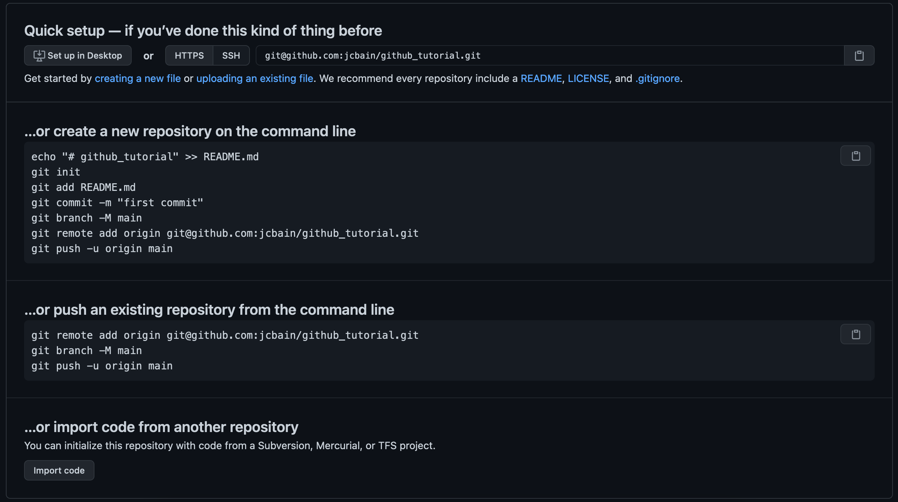

# Creating a New Repo

A repository on Github is going to house your project and provide some nice features for you to interact with using `git`.

To create a new repo on Github, just click the "+" button on the top bar and click "New repository".


Give your repository a name and select whether or not it will be private. Once your options are selected, click "Create Repository".


You should now see the Quick Setup page which will give you some options for either creating a new project on your computer and linking it to this Github (remote) repository or linking an existing git project on your computer to this Github repo.



This tutorial assumes you already have a git project on your computer so we are going to follow the second set of steps. However, if you don't go ahead and follow the first set.

First, you can link the remote repo to your local git project by running

```sh
> git remote add origin git@github.com:<github_user>/<project_name>.git
```

Then you can change offensive `master` branch in your local git repo to `main`.

```sh
> git branch -M main
```

Then all you have to do is push up the `main` branch to your github repository.

```sh
git push -u origin main
```

Now, refresh your github page and you should see your file structure housed in your repo!


